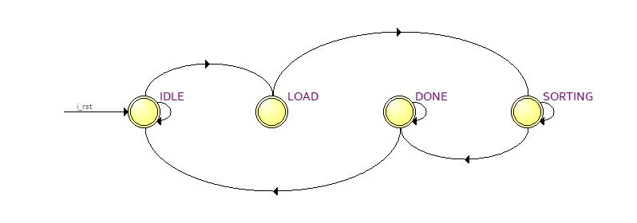
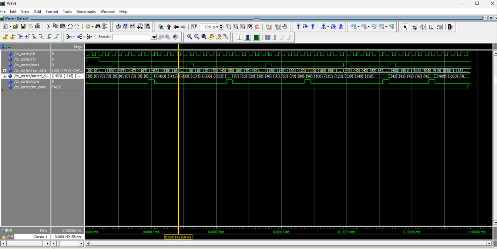

# 16-Channel Parallel Bitonic Sorter (FPGA Accelerator)

Proyek ini bertujuan untuk merancang **Hardware Accelerator** menggunakan VHDL yang mampu mengurutkan (sorting) 16 bilangan integer secara simultan. Memanfaatkan arsitektur FPGA, sistem ini menggunakan algoritma **Bitonic Sort** yang bekerja secara paralel penuh (throughput tinggi), jauh lebih efisien dibandingkan algoritma sorting sekuensial ($O(N^2)$) pada prosesor umum (CPU).

Sistem ini dirancang modular menggunakan konsep **Structural VHDL**, dikontrol oleh **Finite State Machine (FSM)** dengan pendekatan **Microprogramming**, dan diverifikasi menggunakan **Self-Checking Testbench**.

## Fitur Utama

* **Parallel Processing:** Mengurutkan 16 angka 16-bit dalam latency tetap.
* **Modular Design:** Terdiri dari CAS Unit (Compare & Swap) yang disusun menggunakan Generate Statement.
* **Robust Control:** Menggunakan FSM dengan tabel Microcode ROM untuk sinyal kontrol yang bersih.
* **Automated Testing:** Testbench otomatis yang memverifikasi input acak, terurut, terbalik, dan negatif.

## Arsitektur Sistem

Sistem terdiri dari top-level controller yang mengatur aliran data masuk ke jaringan sorting (Bitonic Network). Data mengalir melalui serangkaian komparator tanpa clock (combinational) untuk kecepatan maksimal.

**Finite State Machine (FSM):**
Sistem dikontrol oleh 4 state utama (`IDLE`, `LOAD`, `SORTING`, `DONE`) yang mengatur kapan data diambil dan kapan hasil valid dikeluarkan.

## Cara Simulasi (ModelSim)

Untuk menjalankan simulasi, tambahkan file VHDL ke dalam project ModelSim dan **compile dengan urutan berikut** (Wajib berurutan karena ketergantungan library):

1.  sorter_pkg.vhd (Definisi Tipe Data & Fungsi)
2.  cas_unit.vhd (Unit Dasar Komparator)
3.  bitonic_net.vhd (Jaringan Sorting Struktural)
4.  top_sorter.vhd (Top Level Controller/FSM)
5.  tb_sorter.vhd (Testbench)

## Hasil Simulasi
